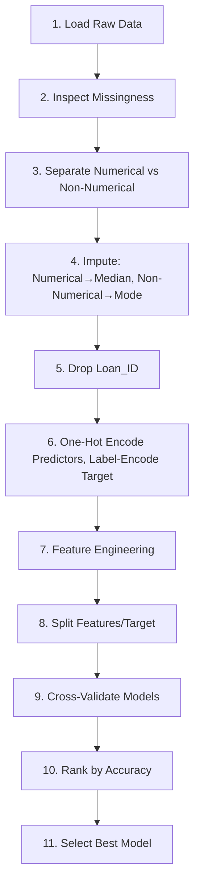

# 🏦 Loan Approval Prediction

## 🎯 Objective

Predict **Loan_Status** (approved vs. not approved) from applicant and loan attributes using a clean preprocessing pipeline, feature engineering, and a multi‑model comparison.

## 📊 Dataset Overview

### Key Fields

- **Identifier**: `Loan_ID` (dropped for modeling)
- **Categorical Features**: `Gender`, `Married`, `Dependents`, `Education`, `Self_Employed`, `Property_Area`, `Loan_Status` (target)
- **Numerical Features**: `ApplicantIncome`, `CoapplicantIncome`, `LoanAmount`, `Loan_Amount_Term`, `Credit_History`

## 🔄 Workflow Summary

### 1. 🔍 Exploration & Missingness

- Assessed per‑column missing percentages and visualized missingness to understand data quality

### 2. 📂 Type Separation

- Split columns into **numerical** vs. **non‑numerical** to apply targeted cleaning strategies

### 3. 🛠️ Missing Value Handling

- **Numerical columns** with missing values → filled with **median**
- **Non‑numerical columns** with missing values → filled with **mode** (with safe fallback for all‑NaN cases)

### 4. 🗑️ Identifier Removal

- Dropped `Loan_ID` (no predictive value; prevents high‑cardinality dummy explosion)

### 5. 🔢 Encoding

- **One‑hot encoded** categorical predictors: `Gender`, `Married`, `Dependents`, `Education`, `Self_Employed`, `Property_Area` (reference category dropped to avoid redundancy)
- **Label‑encoded** the target `Loan_Status` → binary (Y→1, N→0)

### 6. ⚙️ Feature Engineering

- Created **TotalIncome** (Applicant + Coapplicant)
- Created **LoanToIncome** (LoanAmount / TotalIncome) to capture burden
- Created **EMI** (LoanAmount / Loan_Amount_Term) as a simple repayment proxy
- Created **Log_TotalIncome** to reduce skew and stabilize variance

### 7. 🤖 Modeling & Evaluation

- Compared multiple algorithms using **Stratified 5‑Fold Cross‑Validation**
- Tracked **Accuracy** as the primary metric; also monitored **ROC‑AUC, F1, Precision, Recall** for a fuller view

## 🧪 Models Compared

| Model Type            | Algorithm                           | Purpose                           |
| --------------------- | ----------------------------------- | --------------------------------- |
| **Baseline**          | Logistic Regression                 | Explainable, regularized baseline |
| **Tree Ensembles**    | Random Forest, HistGradientBoosting | Robust ensemble methods           |
| **Gradient Boosting** | LightGBM, XGBoost, CatBoost         | Tabular data SOTA performance     |

## 📈 Selection Criterion

- Chose the **highest cross‑validated Accuracy** as the primary selector
- Considered trade‑offs using **ROC‑AUC** and **Recall/Precision** depending on business costs (false approvals vs. false rejections)

## 🔄 End‑to‑End Workflow (Reproducible)

### Detailed Steps:

1. **Load raw data**
2. **Inspect and quantify missingness**
3. **Separate numerical vs. non‑numerical columns**
4. **Impute**: numerical→median; non‑numerical→mode
5. **Drop `Loan_ID`**
6. **One‑hot encode predictors**; **label‑encode `Loan_Status`**
7. **Engineer features**: TotalIncome, LoanToIncome, EMI, Log_TotalIncome
8. **Split features/target**
9. **Cross‑validate models** (Logistic Regression, Random Forest, HistGradientBoosting, LightGBM, XGBoost, CatBoost) with stratified folds
10. **Rank by Accuracy**; review AUC/F1/Precision/Recall
11. **Select best model** for further tuning and deployment

## 📊 Expected Results

- **Tree‑based gradient boosting** typically performs best on this dataset
- **Logistic Regression** provides an interpretable baseline reference

## 🚀 Next Steps (Optional)

### Model Optimization

- [ ] **Hyperparameter tuning** for the top model (learning rate, depth/leaves, regularization)
- [ ] **Probability calibration** and decision‑threshold optimization based on business cost

### Model Interpretability

- [ ] **Feature importance analysis**
- [ ] **SHAP analysis**
- [ ] **Fairness checks** across key demographic groups

### Deployment

- [ ] **Model packaging** for inference
- [ ] **Simple monitoring** (drift detection, performance tracking)

## 🛠️ Technologies Used

### Core Libraries:

- **Data Manipulation**: Pandas, NumPy
- **Machine Learning**: scikit‑learn
- **Gradient Boosting**: LightGBM, XGBoost, CatBoost
- **Visualization**: Matplotlib, Seaborn

⭐ If you found this project helpful, please give it a star!
